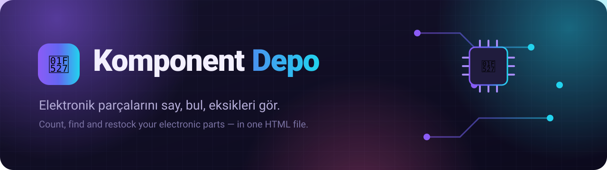
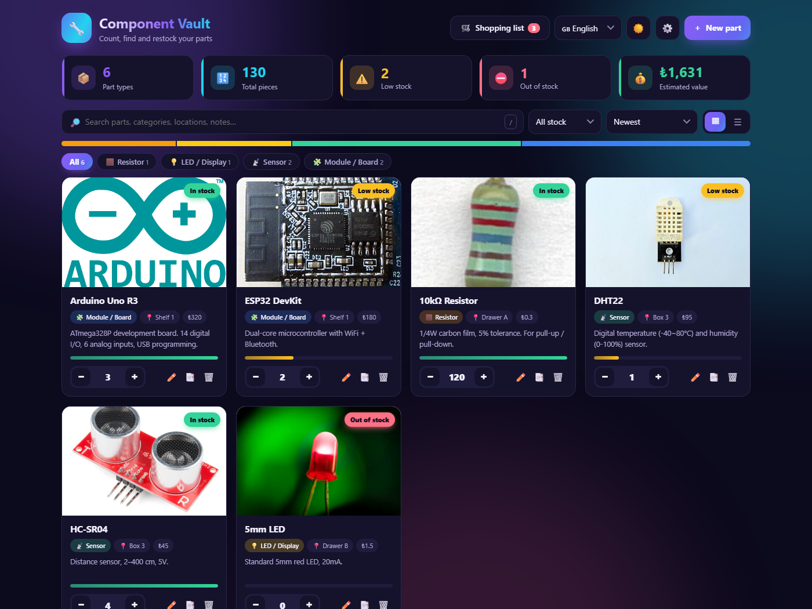
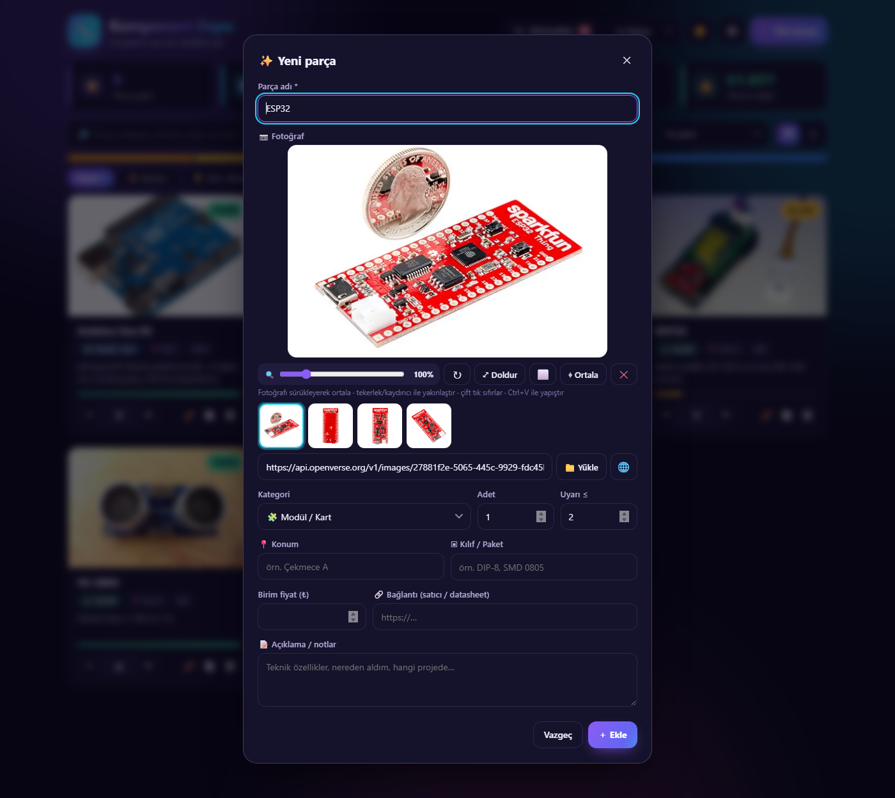
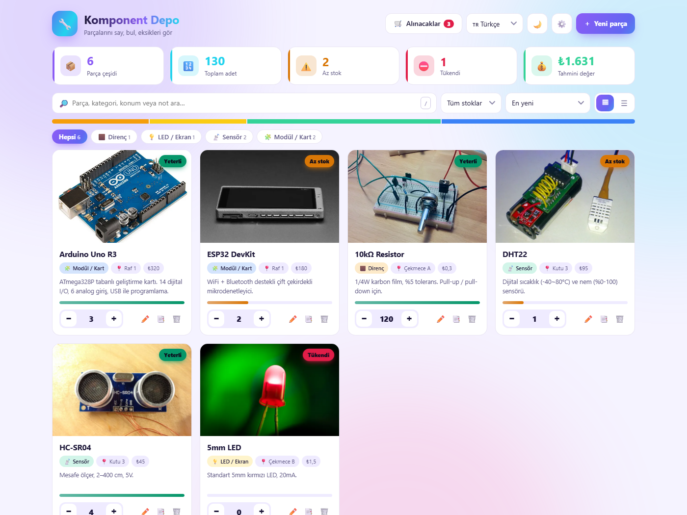

<div align="center">



<h3>Elektronik parça stoğun için hızlı, renkli ve tamamen ücretsiz bir depo uygulaması</h3>

<p>
  <a href="https://Cafu1107.github.io/komponent-depo/"></a>
  <a href="LICENSE"></a>
  
  
</p>

<p>
  🇬🇧 <b>English</b> (varsayılan) &nbsp;·&nbsp; 🇹🇷 Türkçe &nbsp;·&nbsp; 🇩🇪 Deutsch
</p>

<b><a href="https://Cafu1107.github.io/komponent-depo/">Hemen dene →</a></b> &nbsp;|&nbsp; <a href="#-english">English below ↓</a>

<br><br>



</div>

---

## ✨ Neler yapabilir?

<table>
<tr>
<td width="50%" valign="top">

### 📷 Fotoğrafı kendisi bulur
Parçanın adını yaz (`ESP32`, `HC-SR04`, `BC547`…). Uygulama **Wikipedia**, **Wikimedia Commons** ve **Openverse**'te arar, gerçekten açılan ilk fotoğrafı seçer ve sana 12'ye kadar seçenek sunar.

</td>
<td width="50%" valign="top">

### 🎯 Fotoğraf düzenleyici
Fotoğrafı **sürükleyerek ortala**, tekerlekle **yakınlaştır**, **döndür**, *Doldur / Sığdır* arasında geç, zemin rengini seç. Ne görüyorsan kartta da o çıkar.

</td>
</tr>
<tr>
<td valign="top">

### 🛒 Akıllı alışveriş listesi
Az kalan ve tükenen parçalar otomatik listelenir, önerilen miktar ve tahmini tutar hesaplanır. **“Aldım”** deyince stoğa eklenir. Liste tek tıkla kopyalanır.

</td>
<td valign="top">

### 📈 Stok geçmişi
Her artış ve azalış zamanıyla kaydedilir. Hangi parçayı ne zaman kullandığını detay penceresinden görürsün.

</td>
</tr>
<tr>
<td valign="top">

### 🌐 3 dil, 4 para birimi
Site varsayılan olarak **English** açılır. Sağ üstten **Türkçe** veya **Deutsch** seçebilirsin, seçimin hatırlanır. ₺ · $ · € · £. Kategoriler, tarihler ve sayı biçimleri seçtiğin dile uyar.

</td>
<td valign="top">

### 🔒 Verin sende kalır
Sunucu yok, hesap yok. Her şey tarayıcında saklanır. İstersen **JSON** olarak yedekle ya da **Excel (CSV)** olarak dışa aktar.

</td>
</tr>
</table>

### …ve daha fazlası

| | |
|---|---|
| ⚡ **Hızlı adet** | − / + butonunu basılı tut, hızlanarak değişir. <kbd>Shift</kbd> ile 10'ar değişir, sayıya tıklayıp doğrudan yazabilirsin |
| 🧠 **Otomatik kategori** | `BC547` yazınca *Transistör*, `DHT22` yazınca *Sensör* seçilir |
| 🔎 **Anlık arama** | Ad, kategori, konum, kılıf ve notlarda arar, eşleşen yeri vurgular |
| ⭐ **Favoriler & kopyalama** | Sık kullandıklarını işaretle, benzer bir parçayı tek tıkla kopyala |
| ↩️ **Geri al** | Yanlışlıkla sildiğin parçayı geri getirebilirsin |
| ▦ **Kart / liste görünümü** | Fotoğraflı kartlar ya da sıkışık liste |
| 🌗 **Koyu / açık tema** | Canlı mor-camgöbeği palet, akıcı animasyonlar |
| ⌨️ **Kısayollar** | <kbd>/</kbd> ara · <kbd>N</kbd> yeni parça · <kbd>Esc</kbd> kapat |

<div align="center">
<br>
&nbsp;&nbsp;

<br><sub>Otomatik fotoğraf bulma ve düzenleyici &nbsp;·&nbsp; Açık tema (Türkçe)</sub>
</div>

---

## 🚀 Kullanım

**En kolayı:** [canlı demoyu](https://Cafu1107.github.io/komponent-depo/) aç ve kullanmaya başla.

**Kendi bilgisayarında:** [`index.html`](index.html) dosyasını indir ve çift tıkla. Kurulum gerekmez, internet yalnızca fotoğraf aramak için gerekir.

```bash
git clone https://github.com/Cafu1107/komponent-depo.git
cd komponent-depo
start index.html      # macOS: open index.html · Linux: xdg-open index.html
```

### 🔗 Adres parametreleri

| Parametre | Örnek | Ne yapar |
|---|---|---|
| `lang` | `?lang=tr` | Dili seçer (`en` varsayılan, `tr`, `de`) |
| `theme` | `?theme=light` | Temayı seçer (`dark`, `light`) |
| `add` | `?add=ESP32` | “Yeni parça” formunu bu adla açar |

> 💡 Parçalarını bir QR etikete bağlamak istersen örneğin `…/komponent-depo/?add=NE555` gibi bir adres kullanabilirsin.

---

## 🛠️ Nasıl yapıldı?

- **Tek dosya:** HTML + CSS + saf JavaScript. Framework yok, derleme adımı yok.
- **Depolama:** `localStorage`. Yüklediğin fotoğraflar yer kaplamasın diye otomatik olarak 800 px WebP'ye küçültülür.
- **Fotoğraf kaynakları:** [Wikipedia](https://www.wikipedia.org/), [Wikimedia Commons](https://commons.wikimedia.org/), [Openverse](https://openverse.org/). Hepsi açık API'dir ve anahtar gerektirmez.

## 🤝 Katkı

Hata bildirimi, öneri ve pull request'lere açığım. Yeni bir dil eklemek için `I18N` nesnesine bir blok eklemen yeterli.

## 📄 Lisans

[MIT](LICENSE). Özgürce kullan, değiştir ve paylaş.

---

<a id="-english"></a>
<details>
<summary><b>🇬🇧 English</b></summary>

<br>

**Komponent Depo** (*Component Vault*) is a colorful, zero-dependency inventory app for electronic parts that runs in a single HTML file.

- 📷 **Automatic photos**: type a part name and it searches Wikipedia, Wikimedia Commons and Openverse
- 🎯 **Photo editor**: drag to center, zoom, rotate, fill/fit, backdrop color
- 🛒 **Smart shopping list** with suggested amounts, estimated cost and a “Bought” button
- 📈 **Stock history**, ⭐ favorites, duplicate, ↩️ undo delete
- 🌐 **English (default) / Turkish / German**, ₺ $ € £, dark & light themes
- 🔒 **Local-first**: data stays in your browser. JSON backup and CSV export for Excel

**Try it:** https://Cafu1107.github.io/komponent-depo/ (English by default; Turkish & German in the top-right menu), or download `index.html` and open it.

Licensed under **MIT**.
</details>

<div align="center">
<br>
<sub>🔧 Kolay gelsin, iyi lehimler!</sub>
</div>
