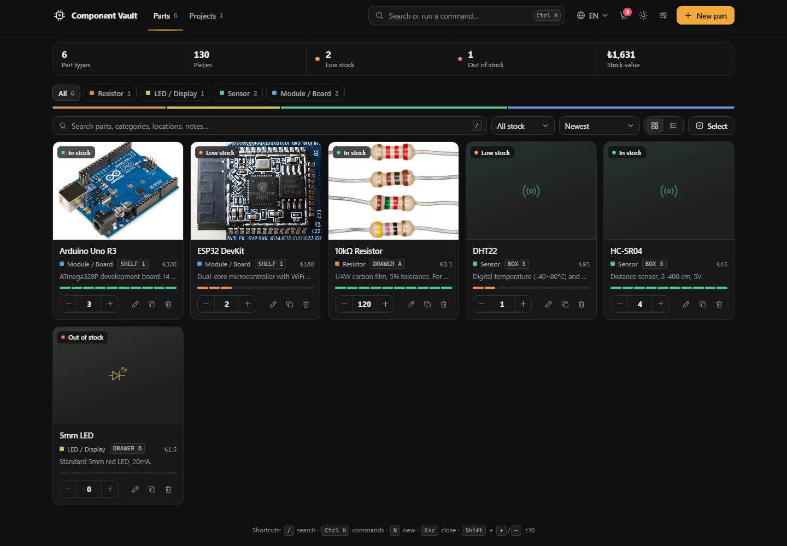
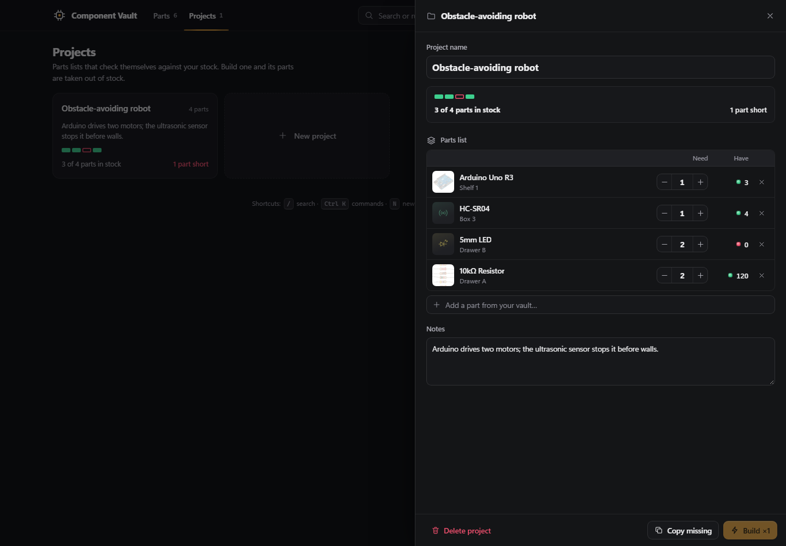
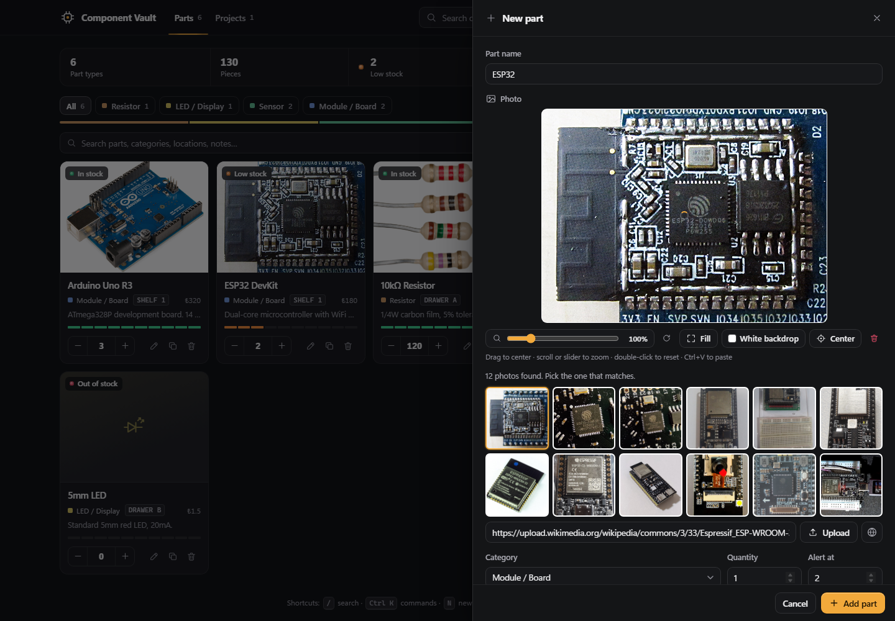
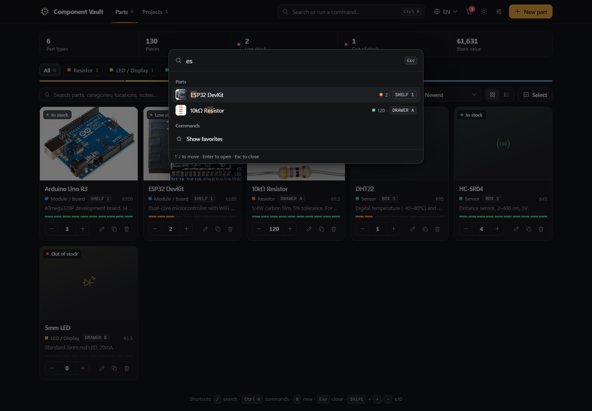
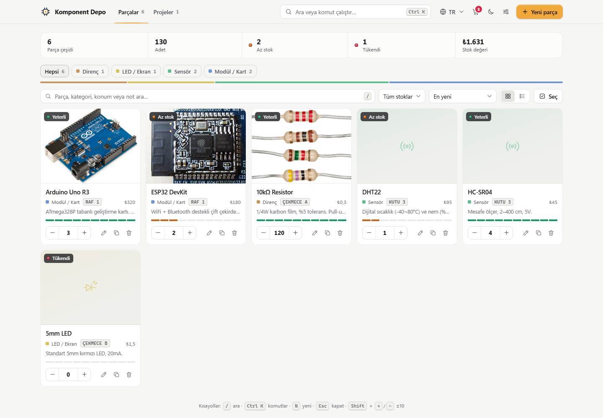
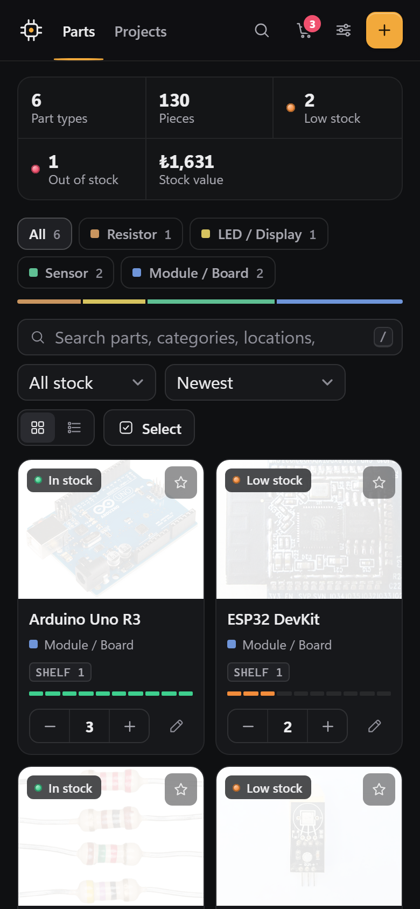

<h3>A free inventory for your electronic parts. Type a part’s name and a real photo is found for you.</h3>

  
  
  
  
  

🇬🇧 <b>English</b> (default) &nbsp;·&nbsp; 🇹🇷 Türkçe &nbsp;·&nbsp; 🇩🇪 Deutsch &nbsp;|&nbsp; <a href="#-türkçe">🇹🇷 Türkçe açıklama ↓</a>

 

---

## ✨ Features

<table>
<tr>
<td width="50%" valign="top">

### 📷 Photos found by name
Type `ESP32`, `HC-SR04` or `BC547` and the app searches **Wikimedia Commons**, **Wikipedia** and **Openverse**, then shows up to **12 photos of that part**. Logos, diagrams, pinouts and unrelated pictures are filtered out. Turkish and German part names are translated for the search.

</td>
<td width="50%" valign="top">

### 🎯 Photo editor
Drag to center, scroll to zoom, rotate, switch between *Fill* and *Fit*, pick a backdrop. You can also drop, paste or upload your own photo. The card shows exactly what the editor shows.

</td>
</tr>
<tr>
<td valign="top">

### 🧩 Projects and parts lists
Group the parts a build needs. Each part shows need vs. have with a stock light, and the project tells you whether it can be built. **Build ×1** takes the parts out of stock (with undo).

</td>
<td valign="top">

### ⌘ Command palette
Press <kbd>Ctrl</kbd> <kbd>K</kbd> (<kbd>⌘</kbd> <kbd>K</kbd> on Mac) to jump to any part or project, filter low stock, switch theme or language, print labels or back up, without leaving the keyboard.

</td>
</tr>
<tr>
<td valign="top">

### 🏷️ QR labels for your drawers
Print A4 label sheets (3 × 7, 63.5 × 38.1 mm) with the part name, category, location and a QR code. Scanning the code opens that part in the app.

</td>
<td valign="top">

### ☑️ Bulk editing
Switch to **Select**, click or <kbd>Shift</kbd>-click parts, then move them to a location, change their category, star them, print their labels or delete them in one go.

</td>
</tr>
<tr>
<td valign="top">

### 🛒 Shopping list
Low and out-of-stock parts are listed with a suggested amount and estimated cost, plus whatever your planned projects are still missing. **Bought** adds them to stock.

</td>
<td valign="top">

### 🔒 Your data stays with you
No server, no account. Everything is saved in your browser. Back up to **JSON**, restore it on another device, or export to **Excel (CSV)**.

</td>
</tr>
</table>

### …and the details

| | |
|---|---|
| 🟢 **Stock lights** | Every part shows *in stock* / *low* / *out* at a glance; a 10-cell level bar shows how full the drawer is |
| ⚡ **Fast counting** | Hold − / + and the count speeds up, <kbd>Shift</kbd> changes it by 10, or type the number |
| 📈 **Stock history** | Every change is logged with a time, and each part lists the projects that use it |
| 🧠 **Auto category** | `BC547` → *Transistor*, `DHT22` → *Sensor*, `ESP32` → *Module / Board* |
| 🌐 **3 languages, 4 currencies** | English, Türkçe, Deutsch · ₺ $ € £ |
| 🌗 **Dark and light theme** | Follows your system the first time, then remembers your choice |
| 📱 **Works on a phone** | Bottom sheets, large touch targets, no zoom-on-input |
| ⌨️ **Shortcuts** | <kbd>/</kbd> search · <kbd>Ctrl</kbd> <kbd>K</kbd> commands · <kbd>N</kbd> new · <kbd>Esc</kbd> close |

 
&nbsp;

 
&nbsp;

 Projects · photo search and editor · command palette · light theme (Türkçe)
  

---

## 🚀 Getting started

1. Open **[cafu1107.github.io/komponent-depo](https://cafu1107.github.io/komponent-depo/)**. Sample parts and a sample project are loaded so you can look around.
2. Press **New part** and type a name. The photo and category are filled in for you.
3. Back up now and then from **Settings → Back up (JSON)**.

Prefer it offline? Download [`index.html`](index.html) (or the file attached to the [latest release](https://github.com/Cafu1107/komponent-depo/releases/latest)) and double-click it. Internet is only needed for the photo search.

### 🔗 Link parameters

| Parameter | Example | What it does |
|---|---|---|
| `lang` | `?lang=tr` | Language: `en` (default), `tr`, `de` |
| `theme` | `?theme=light` | Theme: `dark`, `light` |
| `tab` | `?tab=projects` | Opens the Projects view |
| `q` | `?q=esp32` | Opens the parts view searching for this (QR labels use this) |
| `add` | `?add=NE555` | Opens the New part form with this name |

## ❓ FAQ

<b>Where is my data? Can I use it on my phone and my computer?</b>

Your parts are stored in the browser you use (`localStorage`), on that device only. To move them, use **Settings → Back up (JSON)** on one device and **Restore backup** on the other. Clearing the browser’s site data deletes the inventory, so keep a backup.

<b>The photo search says it can’t reach the sources.</b>

The photo sources limit how many searches you can make in a short time. Wait a few seconds and type the name again, or upload / paste your own photo.

<b>What does the QR code on a label open?</b>

It opens `…/komponent-depo/?q=<part name>`, which searches for that part in the app on the device that scans it. Scan it with the phone where your inventory lives.

<b>Is anything sent to a server?</b>

Only the part name you type, to Wikimedia/Wikipedia/Openverse, to find photos. Your inventory never leaves the browser.

<b>For developers</b>

Everything is in [`index.html`](index.html): HTML + CSS + vanilla JavaScript, no framework, no build step, no dependencies. Open it in a browser to run it.

- UI text lives in `const I18N={en,tr,de}`; keep the three languages in sync.
- Saved data goes through `migrate()` / `migProj()`; change the data shape only with a migration.
- The QR encoder is built in (byte mode, error correction M, versions 1–10).
- Photos come from public APIs with no key: Wikimedia Commons, Wikipedia, Openverse.

See [CONTRIBUTING.md](CONTRIBUTING.md).

## 🤝 Contributing

Bug reports, ideas and pull requests are welcome. See [CONTRIBUTING.md](CONTRIBUTING.md). Adding a language means adding one block to `I18N`.

## 📄 License

[MIT](LICENSE) © Can Karagöz. Free to use, change and share.

---

## 🇹🇷 Türkçe

**Komponent Depo**, elektronik parçaların için ücretsiz bir depo uygulaması. Parçanın adını yazarsın, gerçek fotoğrafı senin için bulunur. Tek bir HTML dosyasıdır; kurulum ve hesap gerekmez.

**[Uygulamayı Türkçe aç →](https://cafu1107.github.io/komponent-depo/?lang=tr)**

### ✨ Özellikler

- 📷 **Adıyla fotoğraf bulur.** `ESP32`, `HC-SR04`, `BC547` yazarsın; Wikimedia Commons, Wikipedia ve Openverse’te aranır, o parçanın **12’ye kadar fotoğrafı** gösterilir. Logolar, şemalar ve alakasız resimler elenir. Türkçe parça adları arama için İngilizceye çevrilir.
- 🎯 **Fotoğraf düzenleyici.** Sürükleyerek ortala, yakınlaştır, döndür, *Doldur / Sığdır*, zemin rengi seç. Kendi fotoğrafını sürükleyip bırakabilir, yapıştırabilir ya da yükleyebilirsin.
- 🧩 **Projeler ve malzeme listesi.** Bir yapımın ihtiyaç duyduğu parçaları grupla; her parça için gerekli / stokta sayısını ve durum ışığını gör. **Yap ×1** parçaları stoktan düşer (geri alınabilir).
- ⌘ **Komut paleti.** <kbd>Ctrl</kbd> <kbd>K</kbd> ile her parçaya ve projeye atla, az stoğu filtrele, tema veya dil değiştir, etiket yazdır, yedek al.
- 🏷️ **QR etiketler.** A4 etiket sayfası (3 × 7, 63,5 × 38,1 mm): parça adı, kategori, konum ve QR kod. Kodu okutunca parça uygulamada açılır.
- ☑️ **Toplu düzenleme.** **Seç** moduna geç, tıkla veya <kbd>Shift</kbd> ile aralık seç; konuma taşı, kategori ata, favorile, etiket yazdır ya da sil.
- 🛒 **Alışveriş listesi.** Azalan ve tükenen parçalar önerilen miktar ve tutarla, planlanan projelerin eksikleriyle birlikte listelenir. **Aldım** stoğa ekler.
- 🟢 **Stok ışıkları ve seviye çubuğu**, 📈 **stok geçmişi**, 🧠 **otomatik kategori**, ⚡ **hızlı sayma** (basılı tut, <kbd>Shift</kbd> ile 10’ar).
- 🌐 **3 dil, 4 para birimi**, 🌗 **koyu ve açık tema**, 📱 **telefonda rahat kullanım**.
- 🔒 **Verin sende kalır.** Sunucu yok, hesap yok; her şey tarayıcında saklanır. JSON yedek, başka cihaza geri yükleme ve Excel (CSV) dışa aktarma var.

### 🚀 Kullanım

1. **[Uygulamayı aç](https://cafu1107.github.io/komponent-depo/?lang=tr).** Etrafa bakabilmen için örnek parçalar ve örnek bir proje yüklü gelir.
2. **Yeni parça**’ya bas ve adını yaz. Fotoğraf ve kategori senin için doldurulur.
3. Ara sıra **Ayarlar → Yedekle (JSON)** ile yedek al.

İnternetsiz kullanmak istersen [`index.html`](index.html) dosyasını indirip çift tıkla. İnternet yalnızca fotoğraf aramak için gerekir.

### ❓ Sık sorulanlar

- **Verim nerede, telefonda ve bilgisayarda aynı anda kullanabilir miyim?** Veriler kullandığın tarayıcıda, o cihazda saklanır. Taşımak için bir cihazda **Yedekle**, diğerinde **Yedeği geri yükle** kullan. Tarayıcı verilerini silmek envanteri de siler; yedek almayı unutma.
- **“Fotoğraf kaynaklarına ulaşılamadı” diyor.** Kaynaklar kısa sürede yapılabilecek arama sayısını sınırlıyor. Birkaç saniye bekleyip adı tekrar yaz ya da kendi fotoğrafını yükle.
- **Etiketteki QR kod neyi açıyor?** `…/komponent-depo/?q=<parça adı>` adresini; okutan cihazdaki uygulamada o parçayı arar. Envanterinin olduğu telefonla okut.

### 🤝 Katkı ve lisans

Hata bildirimi, öneri ve pull request’lere açığım ([CONTRIBUTING.md](CONTRIBUTING.md)). Proje **MIT** lisanslıdır.

 
Happy soldering! · Kolay gelsin, iyi lehimler!

